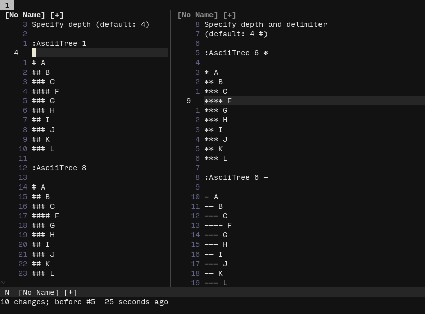
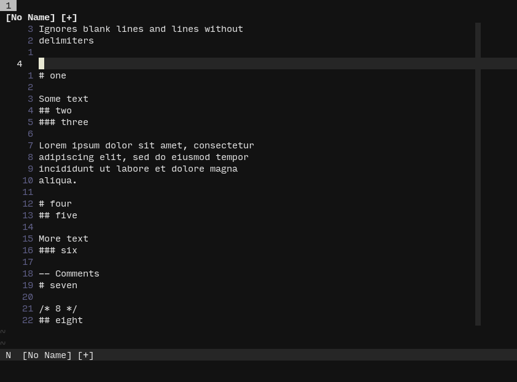

# AsciiTree

Converts selected text into an ASCII tree using the `:AsciiTree` command. Inspired by the VSCode [Ascii Tree Generator plugin](https://marketplace.visualstudio.com/items?itemName=aprilandjan.ascii-tree-generator).





## Installation

```lua
-- Packer
use 'xorid/asciitree.nvim'
```

## Setup

Setup is optional.

```lua
-- Default values
require("asciitree").setup({
	-- Characters used to represent the tree.
	symbols = {
		child = "├",
		last = "└",
		parent = "│",
		dash = "─",
		blank = " ",
	},

	-- How deep each level should be drawn. This value can be overridden by
	-- calling the AsciiTree command with a number, such as :AsciiTree 4.
	depth = 2,

	-- The delimiter to look for when converting to a tree. By default, this
	-- looks for a tree that looks like:
	-- # Level 1
	-- ## Level 2
	-- ### Level 3
	-- #### Level 4
	--
	-- Changing it to "+" would look for the following:
	-- + Level 1
	-- ++ Level 2
	-- +++ Level 3
	-- ++++ Level 4
	delimiter = "#",
})
```

## Usage

Given the following text:
```
# documents
## word
### school
#### class A
#### class B
### work
#### proposal A
#### proposal B
## excel
### spreadsheet A
### spreadsheet B
### spreadsheet C
# code
## work
## github
### repos
```

Select the text in visual mode, and run the command `:AsciiTree`. Your text will be replaced with:
```
├─ documents
│  ├─ word
│  │  ├─ school
│  │  │  ├─ class A
│  │  │  └─ class B
│  │  └─ work
│  │     ├─ proposal A
│  │     └─ proposal B
│  └─ excel
│     ├─ spreadsheet A
│     ├─ spreadsheet B
│     └─ spreadsheet C
└─ code
   ├─ work
   └─ github
      └─ repos
```

The command accepts 2 arguments - the width to use for each tree level, and the style of delimiters. The default is equivalent to `:AsciiTree 2 #`. The default values can be changed using the setup method ([see Setup](#setup)).

If the tree only has one root node, the top level will not display any symbols for the root node.
```
One root (A)
# A        A
## B       ├─ B
### C  ->  │  └─ C
## D       └─ D

Two roots (A & E)
# A       ├─ A
## B      │  ├─ B
### C     │  │  └─ C
## D   -> │  └─ D
# E       └─ E
## F         └─ F
```

### Examples

`:AsciiTree 1`
```
├ documents
│ ├ word
│ │ ├ school
│ │ │ ├ class A
│ │ │ └ class B
│ │ └ work
│ │   ├ proposal A
│ │   └ proposal B
│ └ excel
│   ├ spreadsheet A
│   ├ spreadsheet B
│   └ spreadsheet C
└ code
  ├ work
  └ github
    └ repos
```
<br/>

`:AsciiTree 4`
```
├─── documents
│    ├─── word
│    │    ├─── school
│    │    │    ├─── class A
│    │    │    └─── class B
│    │    └─── work
│    │         ├─── proposal A
│    │         └─── proposal B
│    └─── excel
│         ├─── spreadsheet A
│         ├─── spreadsheet B
│         └─── spreadsheet C
└─── code
     ├─── work
     └─── github
          └─── repos
```
<br />

`:AsciiTree 2 -`

Use `-` instead of `#` to define a tree with a depth of 2:
```

- documents                     ├─ documents
-- word                         │  ├─ word
--- school                      │  │  ├─ school
---- class A                    │  │  │  ├─ class A
---- class B                    │  │  │  └─ class B
--- work                        │  │  └─ work
---- proposal A                 │  │     ├─ proposal A
---- proposal B       --->      │  │     └─ proposal B
-- excel                        │  └─ excel
--- spreadsheet A               │     ├─ spreadsheet A
--- spreadsheet B               │     ├─ spreadsheet B
--- spreadsheet C               │     └─ spreadsheet C
- code                          └─ code
-- work                            ├─ work
-- github                          └─ github
--- repos                             └─ repos
```
<br />

`:AsciiTree 2 *`

Use `*` instead of `#` to define a tree with a depth of 2:
```

* documents                     ├─ documents
** word                         │  ├─ word
*** school                      │  │  ├─ school
**** class A                    │  │  │  ├─ class A
**** class B                    │  │  │  └─ class B
*** work                        │  │  └─ work
**** proposal A                 │  │     ├─ proposal A
**** proposal B       --->      │  │     └─ proposal B
** excel                        │  └─ excel
*** spreadsheet A               │     ├─ spreadsheet A
*** spreadsheet B               │     ├─ spreadsheet B
*** spreadsheet C               │     └─ spreadsheet C
* code                          └─ code
** work                            ├─ work
** github                          └─ github
*** repos                             └─ repos
```
<br />

**Custom Symbols**
```lua
require("asciitree").setup({
	symbols = {
		child = "+",
		last = "L",
		parent = "!",
		dash = "_",
		blank = " ",
	},
	depth = 4,
})
```
```
+... documents
!    +... word
!      !  +... school
!      !  !    +... class A
!      !  !    +... class B
!      !  L. work
!      !     +... proposal A
!      !     +... proposal B
!      L. excel
!         +... spreadsheet A
!         +... spreadsheet B
!         +... spreadsheet C
L... code
     +... work
     L... github
          L... repos
```
